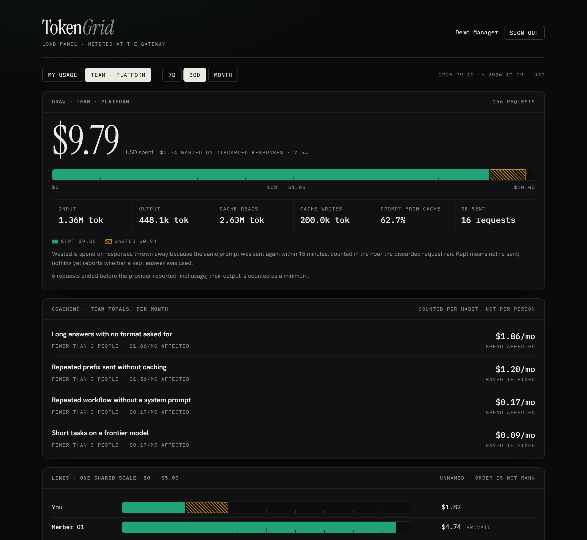
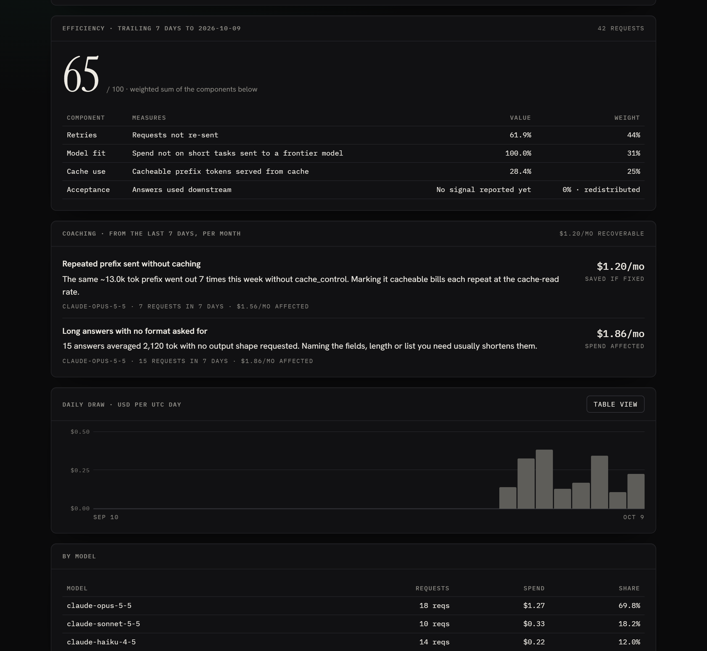
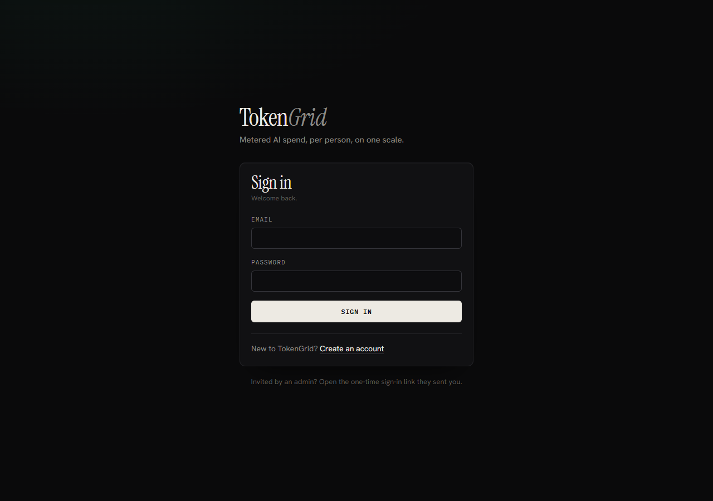

# TokenGrid

**See where your team's AI spend goes, how much of it was wasted, and what to change.**

**Live:** [Dashboard](https://tokengrid.vercel.app) · [Create an account](https://tokengrid.vercel.app/signup) ·
[Gateway API](https://tokengrid-gateway.onrender.com) · [Source](https://github.com/ayushmanjha52/Token-Saver)



> The live instance runs on free tiers (Render, Neon, Vercel). The gateway sleeps
> after 15 idle minutes, so the first request after a pause can take about a minute.

## What it is

Teams now spend real money on AI APIs, and the bill says nothing about who spent
it or whether it was worth it. Two people can burn the same tokens, and one of
them got a finished answer while the other re-sent the same prompt five times.

TokenGrid sits between your code and the AI provider as a gateway. Every call
passes through it, so every call is metered exactly, priced at the rate in force
when it ran, and attributed to a person. On top of that it measures waste and
turns it into concrete advice, priced in dollars per month:

- the response you threw away because you sent the same prompt again,
- the 13k-token prefix you send every time without caching it,
- the short task you ran on the most expensive model.

It is built for coaching, not surveillance: everyone sees their own numbers,
managers see team totals with unnamed lines, and nobody can open one person's
usage without that person's consent.

## Features

- **Exact metering.** Streaming and non-streaming calls to Anthropic and OpenAI.
  Usage is read from a copy of the response after it has been delivered, so the
  gateway never slows a request down. Costs are computed in integer pico-dollars.
- **Waste detection.** A prompt re-sent within 15 minutes marks the earlier
  response as wasted, and its cost is charged to the hour it ran.
- **Coaching.** Five checks run on every call (uncached repeated prefix, frontier
  model on a short task, no output format asked for, large context for a short
  answer, repeated work with no system prompt), each with a monthly dollar figure.
- **Efficiency score.** Retries, model fit, cache use and acceptance, always shown
  with its parts. A part with no data is left out instead of counted as a failure.
- **Budgets.** Monthly caps per key, person or organization. Over the cap the
  gateway answers 402; from 80% it adds a warning header.
- **Reconciliation.** A nightly job compares TokenGrid's numbers with each
  provider's own bill and raises an alert, naming the model, above 2% drift.
- **Privacy built in.** Prompt text is never stored. People can download or
  delete their data. Every look at someone else's usage is logged where they can see it.
- **Accounts.** Sign up with email and password, or join an organization with a
  one-time link from its admin.



## How to use it

### 1. Look around

Open the [dashboard](https://tokengrid.vercel.app) and
[create an account](https://tokengrid.vercel.app/signup). You become the admin
of a new organization. A new organization starts empty: numbers appear once
calls go through the gateway.



### 2. Send your AI calls through TokenGrid

Each person gets a TokenGrid key (`tgk_...`). Use it in place of the provider
key and point the official SDK at the gateway. Nothing else in your code changes.

```ts
import Anthropic from "@anthropic-ai/sdk";
import OpenAI from "openai";

const anthropic = new Anthropic({ apiKey: "tgk_...", baseURL: "https://tokengrid-gateway.onrender.com/anthropic" });
const openai = new OpenAI({ apiKey: "tgk_...", baseURL: "https://tokengrid-gateway.onrender.com/openai/v1" });
```

Or with curl:

```sh
curl https://tokengrid-gateway.onrender.com/anthropic/v1/messages \
  -H "x-api-key: tgk_..." -H "anthropic-version: 2023-06-01" -H "content-type: application/json" \
  -d '{"model":"claude-haiku-4-5","max_tokens":64,"messages":[{"role":"user","content":"Hello"}]}'
```

The organization's real provider key is stored encrypted on the server and never
leaves it. Keys and provider credentials are managed by an admin with the CLI:

```sh
node apps/ingest/dist/admin-cli.js key issue --email you@company.com              # prints a tgk_ key once
TOKENGRID_CREDENTIAL=sk-ant-... node apps/ingest/dist/credential-cli.js --email you@company.com --provider anthropic
```

To group retries by conversation, send `x-tokengrid-session: <conversation id>`
with each request.

### 3. Read the dashboard

- **Draw** is what you spent. The bar is solid green for spend you kept and
  striped amber for spend that was thrown away.
- **Coaching** lists what to change, with the money at stake each month.
- **Efficiency** is a score out of 100 with every component and its weight beside it.
- **Lines** (managers and admins) show each team member on one shared scale,
  unnamed and in no particular order. Opening one person needs their consent.
- **Your data** shows who has looked at your usage, lets you allow or revoke
  individual views, set a password, download everything, or delete your history.

## How it works

```
   your code ──► Gateway (Fastify) ──────────────► Anthropic / OpenAI
                   │  streams the reply back first,
                   │  then reads usage from a copy
                   ▼
              Redis Stream ──► Worker ──► Postgres ◄── Dashboard (Next.js)
                                │  prices each call by its timestamp,
                                │  stores it exactly once, finds retries,
                                │  runs coaching checks and scores,
                                │  reconciles with provider bills nightly
```

## Principles

1. **The gateway is the source of truth.** Consumer subscriptions (Claude Pro,
   ChatGPT Plus) expose no usage API; provider admin APIs are used only to
   reconcile against.
2. **Metering never blocks delivery.** The response is written to the client
   first; usage is read from a copy and recorded afterwards. If Redis or
   Postgres is down, the user still gets their answer.
3. **No score without measured inputs.** Efficiency is built from retries,
   model fit, cache use and acceptance, and is never shown without its parts.
4. **People come first.** Everyone sees their own data; managers see team
   totals with unnamed lines; opening one person needs that person's consent
   and is logged where they can see it. Prompt text is not stored.

## Tech stack

TypeScript throughout · Fastify 5 gateway · Next.js 14 dashboard · PostgreSQL
with Drizzle ORM (monthly-partitioned usage table) · Redis Streams with consumer
groups · pnpm workspaces · AWS KMS envelope encryption in production · Docker,
Fly.io, Render, Vercel and Neon configs included.

## Project layout

| Path | What |
| --- | --- |
| `apps/gateway` | Fastify streaming proxy for Anthropic and OpenAI behind one `ProviderAdapter` interface (`src/providers/`); budget check before forwarding; emits usage to a Redis Stream after the response closes |
| `apps/ingest` | Stream consumer: prices each event by its timestamp, inserts it exactly once with its hourly rollup, maintains spend counters, detects retries, runs lint and scores; nightly reconciliation and retention; operator CLIs |
| `apps/web` | Next.js dashboard, sign-in and sign-up, and `/api/usage` (consent and audit rules live in `src/lib/usage.ts`) |
| `packages/db` | Drizzle schema, migrations, seed, envelope encryption |
| `packages/shared` | Usage event format, exact (integer) cost math, budget keys |
| `tests/integration` | End-to-end suites on a throwaway Postgres; no Docker needed |

## Run it locally

Requires Node 20.12+, pnpm 9, Postgres 16 and Redis 7 (`docker compose up -d` provides both).

```sh
pnpm install
cp .env.example .env          # fill TOKENGRID_LOCAL_KEK, TOKENGRID_SESSION_SECRET, SEED_ANTHROPIC_API_KEY
pnpm db:migrate
pnpm db:seed                  # demo org; prints a TokenGrid key per demo user, once
pnpm dev:ingest               # terminal 1
pnpm dev:gateway              # terminal 2
pnpm dev:web                  # terminal 3 -> http://localhost:3000
```

Sign up at `/signup`, or in development sign in as a seeded user (for example
`manager@tokengrid.local`) without a password. The demo org has one team
(Platform): a manager, members A, B and C (only A allows individual drill-down)
and an org admin. Locally the gateway is at `http://localhost:8787`.

## Tests

```sh
pnpm typecheck
pnpm test                     # unit tests
pnpm build:services && pnpm build:web
REDIS_SERVER_BIN=redis-server pnpm test:integration
```

The integration suites run on a throwaway Postgres (embedded, no Docker) with the
real gateway, worker and dashboard code against fake provider APIs. The last suite
rehearses a cold deploy from the production builds against a real `redis-server`
(consumer groups, a worker crash with a backlog, replay over the real stream); it
is skipped, loudly, when no binary is found.

One check needs real money and is run by hand: **cost vs. the Anthropic console**
(~$0.25–$1). Start the gateway and worker, then
`TOKENGRID_KEY=tgk_... pnpm --filter @tokengrid/gateway acceptance:stage1`, using a key
from a dedicated workspace so the console figure contains nothing else.

## Deploy

See [DEPLOY.md](DEPLOY.md). The gateway and worker need a persistent host (they hold
streaming connections); the dashboard runs on Vercel or its own image. `Dockerfile`
builds all three images, `deploy/` has Fly.io, Render and Compose configs, and the
free-tier setup behind the live demo is documented there too.

## Reference

- **Budgets** are monthly (UTC) per key, user or org:
  `pnpm --filter @tokengrid/ingest budget set --scope user --email a@tokengrid.local --limit 1.00`.
  Over the limit the gateway returns 402 naming the limit and spend; from 80% it adds
  `x-tokengrid-budget-warning`. Calls already in flight when the cap is crossed still
  complete, so spend can overshoot by their cost. If Redis is down the check fails open.
- **Price changes** are new `model_prices` rows dated at least 2 minutes ahead (workers
  cache prices for 60s; the database refuses anything sooner). Rows are append-only.
  A deliberate backfill sets `SET LOCAL tokengrid.allow_backdated_price = on`.
- **Missing price → dead-letter queue.** Add the row, then `pnpm --filter @tokengrid/ingest redrive`.
- **Seed prices** were checked on 2026-09-25. Fast-mode rates are not seeded (cache
  rates for fast mode are not published), so fast-mode events wait in the queue.
- **Web search and other server-tool charges** are not priced yet; such events wait in
  the queue rather than being stored at token cost only.
- **OpenAI specifics.** Streaming Chat Completions only report usage when
  `stream_options.include_usage` is true, so the gateway sets it on streaming requests.
  This is the one place a forwarded body is modified (`OpenAIAdapter.prepareBody`); the
  client receives one extra final chunk with empty `choices`. `prompt_tokens` includes
  cached and cache-write tokens, and both are subtracted. Snapshot model names
  (`gpt-6-sol-2026-08-01`) are priced as their model. Flex, priority/fast and
  long-context (over 272K prompt tokens) calls are separate price variants with no seeded
  rows, so they wait in the queue until verified prices are added.
- **Retries.** The gateway reduces each request to hashes and sizes after the response
  is delivered (no prompt text is stored or leaves the gateway). A retry is a
  structurally identical final turn (same fingerprint, shape, numbers, simhash within 3
  bits) within 15 minutes in the same session.
- **Coaching findings** come from the trailing 7 days, scaled to a month. Every finding
  shows the spend it affects; a saving is shown only where prices make it computable
  (caching, model tier).
- **Efficiency score** = weighted retries (0.35), model fit (0.25), cache use (0.2),
  acceptance (0.2). A component with no measured input has its weight redistributed
  and is shown as such. Every component is stored in `efficiency_scores`.
- **Reconciliation.** Store a provider admin key, scoped to the workspace or project the
  gateway key belongs to so other traffic is not counted:
  `TOKENGRID_CREDENTIAL=sk-ant-admin01-... pnpm --filter @tokengrid/ingest credential --email <admin> --provider anthropic --kind admin --scope <workspace id>`.
  After 01:00 UTC the worker compares the previous day's bill with metered cost per
  model and stores every comparison (charted at `/admin`). Drift over 2% (and over
  $0.001) raises one alert per model and day, posted to `ALERT_WEBHOOK_URL` if set.
- **Retention** is per org (`organizations.retention_days`, default 395). Per-person
  detail older than that is deleted daily; the access audit is kept at least a year.
- **Export and delete-on-request.** Deletion moves a person's hourly totals to an
  unnamed "Former member" line so org totals, budgets and reconciliation still add up.
  Operators: `pnpm --filter @tokengrid/ingest privacy export|delete|retention`.
- **Accounts.** Passwords are scrypt-hashed; 10 failures lock an account for 15 minutes;
  sign-ups are limited to 5 per address per hour. Invited people sign in with a one-time
  link (`admin-cli.js login-link`) and can set a password from their dashboard.

## Author

Built by **Ayushman Jha** ([@ayushmanjha52](https://github.com/ayushmanjha52)).
